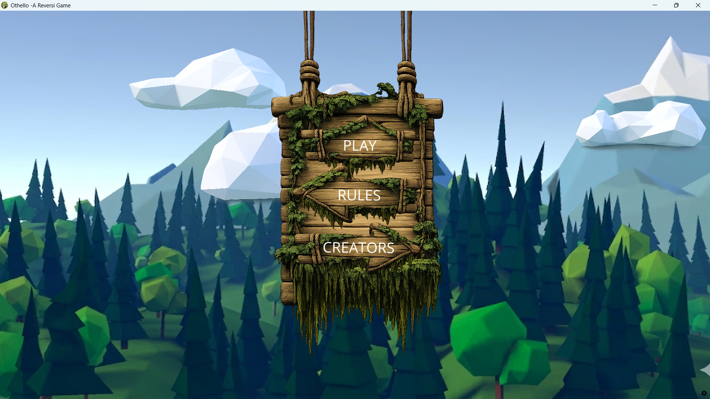
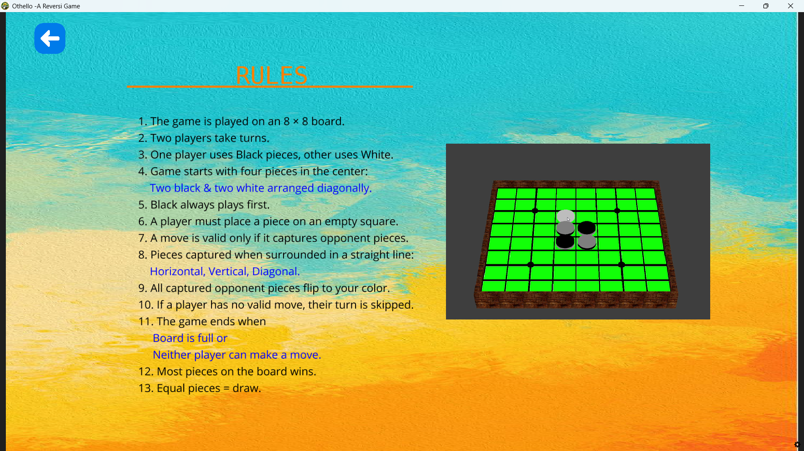
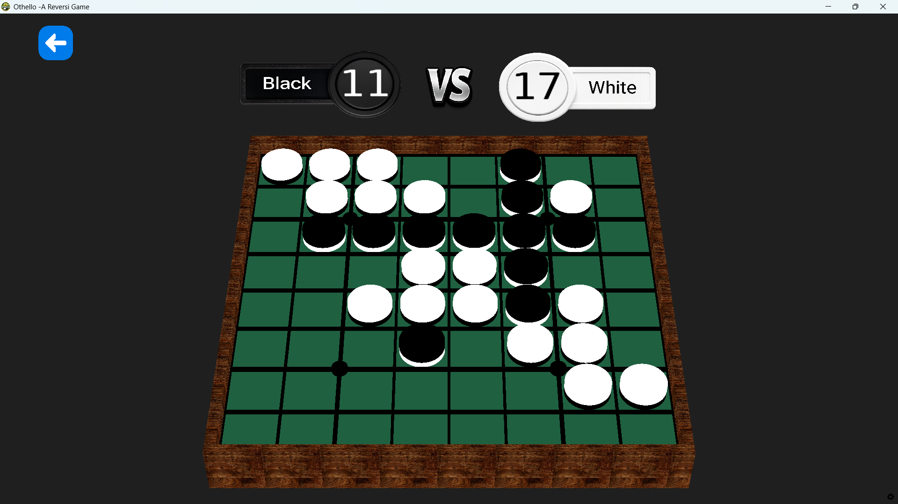

# Othello - Reversi Game

A Python-based implementation of the classic **Othello (Reversi)** board game.  
This project includes:
- An AI opponent built from scratch.
- A GUI integration for a more interactive experience.

## Features
- Play against an AI opponent.
- Supports and **GUI mode**.
- Implements full Othello rules (valid moves, flipping discs, win conditions).
- Modular design for easy extension and experimentation.

## AI Opponent
The AI is implemented from scratch using:
- Move validation logic.
- Heuristic evaluation functions.
- Search algorithms (e.g., minimax with depth control).
You can tweak difficulty by adjusting search depth or heuristics

---

## Getting Started

### Prerequisites
- Python 3.8+
- Required libraries (install via `requirements.txt`):
  ```bash
  pip install -r requirements.txt

---

> **Want to know more?**
> - Check out the [Design Docs](./docs/design.md) for the math behind the AI.
> - See the [Usage Guide](./docs/usage.md) for detailed setup instructions.

## License

This project is licensed under the Apache License 2.0.
You are free to use, modify, and distribute this project, provided you include proper attribution and retain the license notice.

## Acknowledgments
- Inspired by the classic Othello/Reversi board game.
- Built with Python for learning, experimentation, and fun.

## Copyright Disclaimer
We do not own the rights to this game. All rights belong to the rightful owner. No Copyright Infringement Intended.

## Preview




